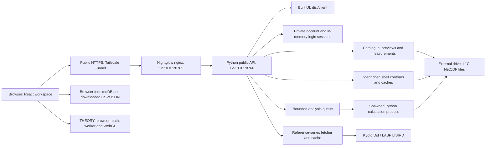

# Carruthers Exploratory Data Analysis (CEDA)

## How to Read This
- If you are an AI new to this project, start with `AGENTS.md`. In the owner's Carruthers workspace, the concise project handoff is `../CURRENT_STATE.md`. Read the relevant sections below on demand; a full-folder or full-README read is unnecessary.
- If you are a member of the science team, you should go to https://nightglow.tail2214e5.ts.net/ and explore right away.
- If you want to assess the technical merit of the project and the thinking process behind the result, use AI to summarize and analyze this document and the code.

## Introduction For Humans
Carruthers Geocorna Imager is a NASA mission to launch a satellite into a special kind of Earth orbit called L1 Lagrange point to observe the geocorona, a layer of the atmosphere that we don't have a good theoretical model yet. We collect observational data from the mission to deduce the shape of the geocorona, and how it is changed by solar weather, with the goal of predicting how the geocorona affects satellites and ground electronics.

People mentioned in this documents:
- Ming Leong Tsui (Lucas) is the CEDA project owner.
- John Clarke is the mission's Deputy Principal Investigator.
- Brian Walsh is the lead of the Carruthers Observatory Student Solar Monitor (COSSMo).

This project has both scientific and technical purposes:
 - It is a tool for visualizing and exploring the data to help the science team gain intuitive understanding of the data to test for checking if the data makes sense and visually inspect correlation with other data like solar weather and moon's shadow on Earth.
 - It is a tool to experiment using AI technology to accelerate research by adopting venture fund Y Combinator's workflow of "build fast, and talk to customers", where the the science team takes to place of the customers.

## Overview of Project History, Challenges, and Solutions from Lucas' Perspective

For After-Action-Assessment, in each iteration below, there is a problem to be solved, and a solution is adopted with reasoning provided. Each solution leads to results which advance the project while creating implications that become the next problem. Problem identification date and the date it is solved are recorded to track development efficiency.

- Problem: Project Requirement initially unclear
	- Start Date: 2026-06-25
	- End Date: 2026-09-09
	- Solution: Adopt AGILE methods from software engineering to ship as quickly as possible to gather feedback
	- Reasoning: Humans struggle to form preference without an existing artifact to examine against their existing preferences, so an initially work is needed even if it will most likely be sloppy.
	- Result: Both professors point out that the visualization aspects of the the prototype turns out to be useful. More focused will be put to visualization.
	- Complications:
		- The amount of scientific knowledge needed to advance the project is unknown in advance.
		- To have an accurate intuitive understanding of how the geocorona changes due to seasons, the image needs put the Earth disk at the image center but current center coordinates are incorrect.
		- The north pole of Earth, and the correctness of the 3D orbit in quaternion form needs to be verified.
		- Analysis software was written in IDL whose compatibility needs to be considered.
		- Current server deployment has to meet the security requirements of Boston University.
		- 

- Problem: The amount of scientific knowledge needed to advance the project is unknown in advance.
	- Start Date: 2026-06-25
	- End Date: 2026-09-09
	- Solution: Prioritize generating visible artifacts and rely on professors feedback to check scientific correctness.
	- Reasoning: Existing theories and mission parameter specification documents are tackled by other teams and it would take a long time to digest without generating anything that could lead to useful feedback from the science team.
	- Result: Both professors point out that the visualization aspects of the the prototype turns out to be useful. More focus will be put to visualization.

- Problem: Current server deployment has to meet the security requirements of Boston University.
	- Start Date: 2026-09-09
	- End Date: 2026-09-18
	- Solution: Use AI to Migrate the deployment from a DGX Spark cluster to a Mac Studio plus and external drive, hosted in Boston University. Main bottleneck is a scheduling problem where all needed personnel's physical presence is required.
	- Result: Set up a server compliant to the security standard of Boston University with 24/7 access and remote monitoring.

- Problem: The image's upward direction needs a documented reference.
	- Start Date: 2026-09-09
	- End Date: 2026-09-18
	- Solution: Lucas used Codex to review the calibration paper's registration convention and add an upward ecliptic-north arrow with an explanation button.
	- Result: The UI distinguishes ecliptic north from Earth's geographic or magnetic north and identifies the convention's source.
	- Complication: The geometry check differs from exact vertical by up to 2.2° across the 1,794 March frames. The indicator is implemented, but exact alignment still needs scientific clarification.

- Problem: Spacecraft pointing and attitude need to be visualized and checked separately from the orbit.
	- Start Date: 2026-09-09
	- End Date: 2026-09-18
	- Solution: Lucas used Codex to check the scalar-last JPL quaternion interpretation, camera rotation order and outward boresight against the supplied geometry. Lucas supplied a schematic spacecraft model for adaptation to CEDA.
	- Result: The trajectory continues to use x/y/z positions; the model follows the recorded attitude, including roll. The solar-cell face points sunward. The 3D view shows the Earth–Sun pointing deviation, its calculation and convention sources, and a fixed-length arrow whose direction and angle label follow the selected observation.
	- Complication: These checks establish consistency with the supplied geometry, not independent pointing accuracy. The model's instrument-deck-to-body-axis mapping remains provisional.

- Problem: The physical meaning of spacecraft +Z needs clarification.
	- Start Date: 2026-09-18
	- Status: Awaiting mission-team clarification; the email is drafted but has not been sent.
	- Solution: Lucas requested the missing references be saved in the Carruthers papers folder and a clarification email be drafted. Lucas asked for an "Assumption on orientation" explanation below the pointing-deviation line.
	- Result: CEDA explicitly assumes the instrument deck's outward normal is body +Z and explains the uncertainty in interpreting the metadata's launch-adapter wording. The quaternion contains roll; the open question is how the physical model maps to the recorded body axes.
	- Complication: A different deck-axis mapping could require a 180° model roll adjustment. The calculated camera pointing deviation does not depend on that model assumption.

- Problem: Frame images flicker while the slider loads a new observation.
	- Start Date: 2026-09-18
	- End Date: 2026-09-18
	- Solution: Lucas reported the flicker; Codex changed both viewers to retain the displayed image until its replacement is decoded, preload nearby frames in a bounded cache, and ignore outdated load responses.
	- Result: Pixels, timestamp, brightness scale, geometry and frame measurements stay matched during loading. Tests covered an eight-second simulated delay, out-of-order responses, failed loads and retries, playback, camera switching and mobile layout. The fix was deployed to Nightglow and committed and pushed with the orientation work in `4eedc3d`.

Pending problems:
- The March L1C `earth_loc` headers are incorrect. CEDA uses validated registered raster centers; updated upstream metadata still needs checking before changing that behavior. Start Date: 2026-09-09
- Analysis software was written in IDL whose compatibility needs to be considered. Start Date: 2026-09-09
- Confirm the exact ecliptic-north alignment and the physical instrument-deck/body-axis mapping with the mission team. The UI records the current convention and assumption; these questions remain open. Start Date: 2026-09-18


## AI Techniques used
- Ask about hardware and software architecture, consider limitations of both first before setting goal for the AI to complete.
- Ask AI to paraphrase and seek clarifications from humans for complex changes.
- Optimize human attention workload by giving high volumne, low complexity task to AI, and fomrulate wordings for complex prompts in parallel.
- Spawn multiple agents to tackle multiple problems simultaneously.
- Use AI to understand code base and explore options.
- Know enough science to progress coding work, e.g., what does quaternion (0,0,0,0) mean in orbital space.
- Queuing prompts without waiting and let AI pop thme one by one, essentially forming a pipeline of inference.

## Project history:

| Date       | What happened                                                                                                                                                                                                                                                                                                                                                                                                                                                                                                                                                                                                                                                                                                                                                                                                                                                                                                                                                                                                                                                                                                                                                                                                         |
| ---------- | --------------------------------------------------------------------------------------------------------------------------------------------------------------------------------------------------------------------------------------------------------------------------------------------------------------------------------------------------------------------------------------------------------------------------------------------------------------------------------------------------------------------------------------------------------------------------------------------------------------------------------------------------------------------------------------------------------------------------------------------------------------------------------------------------------------------------------------------------------------------------------------------------------------------------------------------------------------------------------------------------------------------------------------------------------------------------------------------------------------------------------------------------------------------------------------------------------------------- |
| 2026-06-13 | Lucas contacted Brian about applying image-analysis and data-pipeline skills to space research.                                                                                                                                                                                                                                                                                                                                                                                                                                                                                                                                                                                                                                                                                                                                                                                                                                                                                                                                                                                                                                                                                                                       |
| 2026-06-17 | Lucas and Brian coordinated an introductory meeting with John.                                                                                                                                                                                                                                                                                                                                                                                                                                                                                                                                                                                                                                                                                                                                                                                                                                                                                                                                                                                                                                                                                                                                                        |
| 2026-06-18 | Lucas confirmed the meeting; Brian identified Carruthers as the potential project.                                                                                                                                                                                                                                                                                                                                                                                                                                                                                                                                                                                                                                                                                                                                                                                                                                                                                                                                                                                                                                                                                                                                    |
| 2026-06-25 | Lucas, Brian and John held the introductory discussion; Lucas confirmed availability to begin during summer.                                                                                                                                                                                                                                                                                                                                                                                                                                                                                                                                                                                                                                                                                                                                                                                                                                                                                                                                                                                                                                                                                                          |
| 2026-07-13 | John confirmed the team wanted Lucas working on Carruthers data analysis and began coordinating onboarding.                                                                                                                                                                                                                                                                                                                                                                                                                                                                                                                                                                                                                                                                                                                                                                                                                                                                                                                                                                                                                                                                                                           |
| 2026-07-14 | Lucas accepted the arrangement, confirmed summer availability and supplied appointment information.                                                                                                                                                                                                                                                                                                                                                                                                                                                                                                                                                                                                                                                                                                                                                                                                                                                                                                                                                                                                                                                                                                                   |
| 2026-07-17 | Lucas reported appointment approval; John supplied introductory atmospheric-science material.                                                                                                                                                                                                                                                                                                                                                                                                                                                                                                                                                                                                                                                                                                                                                                                                                                                                                                                                                                                                                                                                                                                         |
| 2026-07-18 | Lucas read the introductory material and raised questions about exospheric models, storms and available data.                                                                                                                                                                                                                                                                                                                                                                                                                                                                                                                                                                                                                                                                                                                                                                                                                                                                                                                                                                                                                                                                                                         |
| 2026-07-20 | Lucas studied geocoronal structure and papers supplied by Brian.                                                                                                                                                                                                                                                                                                                                                                                                                                                                                                                                                                                                                                                                                                                                                                                                                                                                                                                                                                                                                                                                                                                                                      |
| 2026-07-21 | Lucas continued studying the exobase, charge exchange and numerical modeling.                                                                                                                                                                                                                                                                                                                                                                                                                                                                                                                                                                                                                                                                                                                                                                                                                                                                                                                                                                                                                                                                                                                                         |
| 2026-07-25 | Lucas reviewed the Chamberlain model and its limitations; John supplied additional calibration and geocorona papers.                                                                                                                                                                                                                                                                                                                                                                                                                                                                                                                                                                                                                                                                                                                                                                                                                                                                                                                                                                                                                                                                                                  |
| 2026-07-27 | Lucas studied measurement geometry and mission requirements and made a 3D satellite model.                                                                                                                                                                                                                                                                                                                                                                                                                                                                                                                                                                                                                                                                                                                                                                                                                                                                                                                                                                                                                                                                                                                            |
| 2026-07-29 | Lucas worked through much of the instrument-calibration section.                                                                                                                                                                                                                                                                                                                                                                                                                                                                                                                                                                                                                                                                                                                                                                                                                                                                                                                                                                                                                                                                                                                                                      |
| 2026-07-30 | Lucas started formulating the conversion from raw sensor counts to corrected brightness.                                                                                                                                                                                                                                                                                                                                                                                                                                                                                                                                                                                                                                                                                                                                                                                                                                                                                                                                                                                                                                                                                                                              |
| 2026-07-31 | Lucas recorded further calibration study. The repeated wording does not establish a separate completed pipeline.                                                                                                                                                                                                                                                                                                                                                                                                                                                                                                                                                                                                                                                                                                                                                                                                                                                                                                                                                                                                                                                                                                      |
| 2026-08-01 | Lucas sent a literature/design-paper progress report and requested real data.                                                                                                                                                                                                                                                                                                                                                                                                                                                                                                                                                                                                                                                                                                                                                                                                                                                                                                                                                                                                                                                                                                                                         |
| 2026-08-13 | Lucas and John scheduled the next working meeting.                                                                                                                                                                                                                                                                                                                                                                                                                                                                                                                                                                                                                                                                                                                                                                                                                                                                                                                                                                                                                                                                                                                                                                    |
| 2026-08-14 | Lucas, John and Brian met and established sample-data, code, storage and SCC-access tasks. Lucas investigated SCC access and reported needing project membership.                                                                                                                                                                                                                                                                                                                                                                                                                                                                                                                                                                                                                                                                                                                                                                                                                                                                                                                                                                                                                                                     |
| 2026-08-16 | John sent the Carruthers mission paper to Lucas.                                                                                                                                                                                                                                                                                                                                                                                                                                                                                                                                                                                                                                                                                                                                                                                                                                                                                                                                                                                                                                                                                                                                                                      |
| 2026-08-17 | Brian supplied sample data and Python plotting code; Lucas acknowledged the unpublished-data restriction.                                                                                                                                                                                                                                                                                                                                                                                                                                                                                                                                                                                                                                                                                                                                                                                                                                                                                                                                                                                                                                                                                                             |
| 2026-08-18 | Lucas produced two visualization videos comparing fixed and dynamic scaling and identified an exposure/normalization question.                                                                                                                                                                                                                                                                                                                                                                                                                                                                                                                                                                                                                                                                                                                                                                                                                                                                                                                                                                                                                                                                                        |
| 2026-08-24 | John sent Lucas a numerical-model/image-simulation paper to clarify the images.                                                                                                                                                                                                                                                                                                                                                                                                                                                                                                                                                                                                                                                                                                                                                                                                                                                                                                                                                                                                                                                                                                                                       |
| 2026-08-31 | Lucas read the background-removal and radiometric-sensitivity papers supplied by John and arranged a review with him.                                                                                                                                                                                                                                                                                                                                                                                                                                                                                                                                                                                                                                                                                                                                                                                                                                                                                                                                                                                                                                                                                                 |
| 2026-09-01 | Lucas and John reviewed processing stages; John supplied IDL procedures; Lucas implemented a Python L1A visualization that John confirmed looked correct.                                                                                                                                                                                                                                                                                                                                                                                                                                                                                                                                                                                                                                                                                                                                                                                                                                                                                                                                                                                                                                                             |
| 2026-09-02 | Lucas received confirmation from John that the public L1C dataset was released; John confirmed the recurring meeting arrangement.                                                                                                                                                                                                                                                                                                                                                                                                                                                                                                                                                                                                                                                                                                                                                                                                                                                                                                                                                                                                                                                                                     |
| 2026-09-03 | Lucas generated an initial L1C visualization. Brian and John provided feedback on coordinates and units; Brian requested quantitative extraction.                                                                                                                                                                                                                                                                                                                                                                                                                                                                                                                                                                                                                                                                                                                                                                                                                                                                                                                                                                                                                                                                     |
| 2026-09-05 | Lucas corrected centering and brightness units, demonstrated spatial/time selection with CSV/JSON extraction, and requested scientific feedback and storage information.                                                                                                                                                                                                                                                                                                                                                                                                                                                                                                                                                                                                                                                                                                                                                                                                                                                                                                                                                                                                                                              |
| 2026-09-07 | Brian gave Lucas positive feedback on the extraction demo.                                                                                                                                                                                                                                                                                                                                                                                                                                                                                                                                                                                                                                                                                                                                                                                                                                                                                                                                                                                                                                                                                                                                                            |
| 2026-09-08 | Lucas added improved scales, contours, dawn/dusk sectors, radial profiles, a baseline, SYM-H/Lyman-alpha comparisons and a 3D orbit/image view.                                                                                                                                                                                                                                                                                                                                                                                                                                                                                                                                                                                                                                                                                                                                                                                                                                                                                                                                                                                                                                                                       |
| 2026-09-09 | John approved Lucas’s presentation improvements and pursued CAS shared storage.                                                                                                                                                                                                                                                                                                                                                                                                                                                                                                                                                                                                                                                                                                                                                                                                                                                                                                                                                                                                                                                                                                                                       |
| 2026-09-10 | Lucas published Observation Lab on Spark, established Git history, deployment limits and monitoring, verified the dataset/analyses, and added paired-region curves, layout improvements and contour circularity.                                                                                                                                                                                                                                                                                                                                                                                                                                                                                                                                                                                                                                                                                                                                                                                                                                                                                                                                                                                                      |
| 2026-09-11 | John explained that incorrect Earth-location headers were an upstream L1C bug and relayed BU’s computer-setup requirements; Lucas requested clarification of those requirements.                                                                                                                                                                                                                                                                                                                                                                                                                                                                                                                                                                                                                                                                                                                                                                                                                                                                                                                                                                                                                                      |
| 2026-09-14 | Lucas and John coordinated upcoming team meetings and an on-campus discussion.                                                                                                                                                                                                                                                                                                                                                                                                                                                                                                                                                                                                                                                                                                                                                                                                                                                                                                                                                                                                                                                                                                                                        |
| 2026-09-15 | Lucas attended research-group and project meetings and gathered researcher needs; John supplied coordinate definitions and velocity-distribution code.                                                                                                                                                                                                                                                                                                                                                                                                                                                                                                                                                                                                                                                                                                                                                                                                                                                                                                                                                                                                                                                                |
| 2026-09-16 | Lucas and John discussed shared-machine/storage access; John requested a room key for Lucas; Brian supplied a potential collaborator’s contact.                                                                                                                                                                                                                                                                                                                                                                                                                                                                                                                                                                                                                                                                                                                                                                                                                                                                                                                                                                                                                                                                       |
| 2026-09-17 | Lucas met John for Carruthers setup; John confirmed that Nightglow was operational and began coordinating Brian’s account with him.                                                                                                                                                                                                                                                                                                                                                                                                                                                                                                                                                                                                                                                                                                                                                                                                                                                                                                                                                                                                                                                                                   |
| 2026-09-18 | Lucas did the following:<ul><li>Sever deployment:<ul><li>Migrated data and server to BU's machine</li><li>Launched server.</li><li>Set up server monitoring (Betterstack) and incident reporting.</li></ul></li><li>User interface improvements:<ul><li>Changed the name "radiance" to brightness.</li><li>Fixed frame flicker by implementing decoded-image swaps and adjacent-frame preloading for both 2D and 3D.</li></ul></li><li>Improvements on scientific information:<ul><li>Replaced SYM-H with hourly Kyoto DST.</li><li>Added the ecliptic-north indicator.</li><li>Added quaternion-driven spacecraft model.</li><li>Added Earth–Sun pointing deviation and direction .arrow, and orientation-assumption explanation.</li></ul></li><li>Documentation:<ul><li>Renamed the app Carruthers Exploratory Data Analysis (CEDA).</li><li>Reorganized the README for human and AI readers.</li><li>Documented mission roles and project history for auditing.</li></ul></li></ul>                                                                                                                                                                                                                               |
| 2026-10-01 | Lucas added the Zoennchen 2015 model overlay and reported lower brightness than the L1C images. He asked how to handle the WFI regions outside the model's range.                                                                                                                                                                                                                                                                                                                                                                                                                                                                                                                                                                                                                                                                                                                                                                                                                                                                                                                                                                                                                                                     |
| 2026-10-02 | John recommended keeping the overlay within its intended range, checking whether the brightness difference came from a factor of 4π, and replacing the Sun in the 3D view with an Earth-to-Sun direction arrow. Lucas limited the overlay to 3–8 Rᴇ and added the arrow.                                                                                                                                                                                                                                                                                                                                                                                                                                                                                                                                                                                                                                                                                                                                                                                                                                                                                                                                              |
| 2026-10-03 | Lucas checked the Rayleigh conversion and removed the extra 4π multiplier. He made solar Lyman-alpha irradiance adjustable and asked whether COSSMo measurements could supply it. He changed the deviation angle to compare the camera boresight with the spacecraft-to-Earth direction, kept the value as four-decimal text, and removed the angle drawing and lower caption. He extended the Sun arrow beyond L1, moved its label to the tip, removed the Earth and Carruthers labels, and made the remaining scene labels white and the same size.                                                                                                                                                                                                                                                                                                                                                                                                                                                                                                                                                                                                                                                                 |
| 2026-10-03 | Under Prof. Walsh’s suggestion, Lucas added a numerical model called the Zoennchen model to compare against observational data. He found an approximately one-order-of-magnitude difference in brightness between the model and the observations. The shapes of the model and observed brightness contours also differ. Using AI to research the model’s formulas, Lucas found that the brightness calculation is:<br><br>$B_{\mathrm{kR}}=\frac{g}{10^{9}}\int_{\mathcal{L}}n_{\mathrm{H}}(\mathbf{r}(s))\left(\frac{11}{12}+\frac{1}{4}\cos^{2}\theta(s)\right)\,ds$<br><br>where $g$ is:<br><br>$g = 3.47 \times 10^{-4} \left( \frac{F_{\mathrm{Ly}\alpha}} {10^{11}\,\mathrm{photons}\,\mathrm{cm}^{-2}\,\mathrm{s}^{-1}} \right)^{1.21} \,\mathrm{s}^{-1}$<br><br>Lucas suggested using the Sun-facing camera, COSSMO, to obtain $F_{\mathrm{Ly}\alpha}$ values. However, Prof. Clarke reported that the instrument is not yet operational, so the next best option is to use data from LASP.                                                                                                                                                                                                                   |
| 2026-10-05 | Prof. Clarke clarified the source of the g factor and provided directions to synchronize it with existing data. In his words:<br><br>"For the solar g factor a definition is given in a review paper by Bob Meier from 1991 (partial version attached).   See Eq. 23 on pg. 47.  The “F” term is the incident solar flux.  These days with relatively high solar activity the line integrated solar Lyman-alpha flux at the Earth is about 5-7 x e11 photons per cm^2 - sec. But, the brightness will also depend on the density.  Right now the model tool sets an upward flux from the exobase in number / cm^2 - sec.  It might be better to specify this as an H density at the exobase in number / cm^3.  Then the upward flux can be calculated from the atom speeds in the velocity distribution, this would require some integration across the velocity profile.  The total number in the profile would equal the number density at the exobase (I have found that 6.e4 is a more or less average value for density) and the speed would dictate the upward flux at each value. I will think about this a bit more, but a difference in density could also explain the discrepancy with the Zoenchen model." |

## Introduction For AIs

### Mission and first session

You are maintaining Carruthers Exploratory Data Analysis (CEDA), a workbench
for researchers working with NASA Carruthers geocoronal observations.
Success means a researcher can select observations and a region, inspect the
images, obtain scientifically consistent brightness measurements, compare them
with reference series, and export enough provenance to reproduce the result. The definition of success may be revised as the functionalities of CEDA drifts over time and over ownership changes.

For each task, preserve scientific correctness first, then data/visitor isolation
and service availability, then usability. Follow the current user request; the
backlog below is context, not an instruction to implement every item. Leave
For Humans for the owner to write.

Start here, without assuming access to the previous conversation:

1. Read the current request and any applicable `AGENTS.md`. Inspect the checkout
   before editing; preserve existing user changes, including documentation.
   Run these from the repository root:

   ```sh
   git status --short --branch
   git diff --stat
   git log -5 --oneline
   git remote -v
   ```

   Inspect the diff of files you intend to change. The repository is
   <https://github.com/lucastsui/carruthers-observation-lab>. On the owner's
   development Mac the checkout is
   `/Users/tsuimingleong/Documents/My vault/Carruthers/research-app`; a fresh clone
   may be elsewhere.
2. For orientation or continuing work, read the workspace's `../CURRENT_STATE.md`
   when available. Use the [task map](#task-map) to locate implementation/tests.
   Consult the [baseline](#last-verified-baseline), [feature requirements](#expected-features)
   and [scientific rules](#scientific-rules-to-preserve) only as relevant to the task.
   In a standalone clone without the private workspace handoff, use these sections
   for the context you need.
3. Establish which environment the task concerns: local checkout, local running
   app, or deployed Nightglow service. A Git commit or successful local build does
   not establish what code is running in production.
4. Inspect the relevant code and test assumptions. For deployment work, also read
   [the current Nightglow operations guide](deploy/nightglow/README.md) and inspect
   the live state. Historical migration descriptions are not current-state checks.
5. Make the requested change and use the [verification workflow](#working-procedure-and-verification).
   If data, permissions or network access prevent a check, state exactly what
   remains unverified rather than substituting a successful unrelated check.

How to interpret this document: Expected features and Scientific rules
are the behavior to preserve unless the user changes the requirement. The
architecture describes the current implementation and can evolve. The baseline
records dated evidence and must be rechecked when relevant. If implementation
and a requirement disagree, identify the discrepancy before treating either as
proof that a scientific behavior is correct.

### Last verified baseline

This section was reviewed against source through `8688d60` on 2026-10-03.
A read-only Nightglow check matched 21 selected source/documentation/UI-entry
files with the checkout and found a healthy 1,794-frame catalogue. The earlier
functional checks below were recorded during their respective changes; this
documentation review did not rerun the application test suites or resilience
tests. These records are not a fresh uptime check whenever the README is read.

| Item | Last recorded state | Evidence / where to check |
| --- | --- | --- |
| Product | CEDA title; visible brightness terminology; hourly Kyoto Dst replacing the displayed SYM-H series. | Commits `09cc54a`, `4ec23dc`, `ec184ae`; current interface and reference tests. |
| 3D view and playback | Four-decimal Earth-pointing deviation text; no deviation drawing or lower caption. Extended Earth–Sun arrow with its label at the tip; remaining scene labels are white and the same size. Ecliptic-north indicator, attitude-driven spacecraft, orientation explanation and complete-frame swaps remain. | Commits `733fe3a`, `bd15fa8`, `8688d60`; latest UI release `20261003T131927Z-orbit-labels`. Type/build, focused lint, three display tests and both-camera browser checks passed during that UI change. Release evidence is in the owner's `.local/` directory, outside Git. |
| Access | One configured account gates the public UI/assets and data APIs; separate browser-visitor cookies retain job ownership. | `auth.py`, `login.html`, `public_server.py`, `tests/test_auth.py`; [sign-in operations](deploy/nightglow/README.md#application-sign-in). |
| Zoennchen overlay | 2015 solar-minimum/maximum density models provide 3–8 Rᴇ single-scattering brightness contours in the 2D viewer. Irradiance is adjustable from 1 to 30 mW/m²; no extra 4π brightness multiplier. | `zoennchen.py`, `components/model-overlay-controls.tsx`, [method and recorded validation](docs/zoennchen-overlay.md). |
| THEORY | Browser-computed spherical density, 3D atom projection with 120 moving trails, and randomly located example launches. Bound dots remain tracked until their exobase return. | `lib/theory.ts`, `lib/theory-particles.ts`, their tests and the theory section below. |
| Public site | `https://nightglow.tail2214e5.ts.net`, served entirely by Nightglow. | [Nightglow operations](deploy/nightglow/README.md); current `/health` and public functional validation. |
| Collection | March 2026 L1C v1.3 only: 62 files / 1,794 frames, split into 633 WFI and 1,161 NFI. | [Dataset manifest](deploy/dataset-manifest.json), catalogue and scientific regression fixtures. |
| Persistence | Observations/state/cache on Nightglow's external volume; saved user analyses in browser IndexedDB. | Storage architecture below, `lib/saved.ts`, Nightglow supervisors. |
| Host independence | Spark and the development Mac are outside the production request path. | Commit `e7f667b`; [migration evidence](deploy/MIGRATION-NIGHTGLOW.md). |
| Logout behavior | Fresh background service starts and public analyses/exports passed while Nightglow stayed at its login screen. Actual reboot testing is still outstanding. | `logout-fresh-start.json`, `logged-out-public-validation.json` and `logout-final-health.json` under the Nightglow application root; operations guide. |

Detailed tests must be rerun as appropriate for the change. Do not report old
results as new validation. See [known gaps](#known-gaps-and-future-work) before
assuming that later datasets, shared saves or multiple researcher accounts are supported.

### Expected features

Treat these as acceptance criteria for existing functionality. A future feature
is listed separately under known gaps.

| Area | Expected behavior |
| --- | --- |
| Collection and time selection | Browse March 2026 L1C v1.3 data: 62 NetCDF files, 633 WFI frames and 1,161 NFI frames. Select a camera and UTC interval. Switching cameras selects the nearest available observation time. Start on WFI, 2026-03-15, with a 4.5–5.5 Earth-radius annulus. |
| Image navigation | Provide previous/next controls, a frame slider, playback with adjustable frames per second, keyboard/wheel navigation when the viewer is focused, and 1×/2×/4× zoom. Retain the complete displayed frame until its replacement image is decoded and its selected brightness contours are available, then swap pixels, contours, image geometry, time label and brightness scale together. This shared frame state feeds both 2D and 3D. Radius contours are synchronous geometry; disabling brightness contours requires no contour request. For both WFI and NFI, preload up to 100 earlier and 100 upcoming frames around the selected frame, nearest first, within the selected interval (up to 201 including the current frame). Move this window during playback and scrubbing; prioritize the selected frame, limit background loading to two frame bundles at a time with at least 300 ms between starts (each may request one image and one contour set), discard obsolete queued work, and protect the current window from late responses. Keep the decoded-image cache bounded and ignore stale display loads during scrubbing. Light sections on the frame slider and its loaded count show complete frames in the current camera/interval at the current brightness scale and contour mask. Markers update only after image decoding and required contours finish, and after eviction from the 201-frame working set; pending/failed loads and other scales or masks are excluded. Failed foreground loads retain the previous complete frame and provide Retry. Browser HTTP cache entries outside this working set are not counted. Show observation time, exposure and frame flags. |
| Brightness display | Use the visible term brightness, in kR. Render logarithmic `gist_heat` images with adjustable minimum/maximum handles, labeled ticks and camera-specific reset: WFI 0.001–270 kR; NFI 0.1–270 kR. The slider permits a minimum of 0.0001 kR for faint outer emission. Display changes must not change numeric measurements. |
| Overlays | Offer brightness contours, projected-radius contours, or no contours; retain the blue 1 Earth-radius reference boundary. Brightness contours use the original numeric arrays and the selected validity mask. |
| Zoennchen reference | In the 2D image view, independently select Off, 2015 solar minimum or solar maximum alongside the observation contours. WFI defaults Off; NFI defaults solar maximum. Each camera remembers its model choice until reload. Opacity (default 85%) and solar Lyα irradiance (1–30 mW/m², default 6, step 0.1) are shared controls. Illumination is manually set, not date-matched. Dashed cyan contours show the single-scattering **3–8 Rᴇ shell contribution**, not total brightness; inner sightlines are masked and the outer density is truncated. The caption/loading/error state occupies a permanent slot above the color scale so the image does not resize. See [method and limits](docs/zoennchen-overlay.md). |
| Region selection | Support annulus, annular sector, rectangle, single pixel, Dawn + Dusk and Paired annular sectors. Allow image dragging and numeric controls. Use projected Earth radii, x right and y up; angles begin at image right and increase toward image top. |
| Paired dawn/dusk regions | Select two filled pies extending from Earth to the raster edges, centered at 180°/0°. A shared 1–180° opening angle controls both, including through edge dragging. Calculate and label separate Dawn/Dusk curves; CSV has two labeled rows per frame, and JSON retains both regions and the shared recipe. |
| Paired annular sectors | Drag two diagonal corners on either image side to set inner/outer radii and angular bounds. Mirror the other sector by a 180° rotation about Earth; corner handles resize both. Numeric angles describe the right sector (−90° to 90°). Keep separate Dawn/Dusk measurements, curves and CSV rows; save/export all four bounds. |
| Current-frame measurements | Refresh the selected-region statistics and full-annulus radial profile automatically when playback is paused. The radial profile is independent of the selected region and offers CSV export with bin bounds and valid-pixel coverage. |
| Time-series analysis | Start explicitly with Analyze at the top-right of the image. Show progress, cancellation and retry. Region, camera, interval or interpolation-mask changes invalidate/cancel outdated work and hide stale results/exports. Scrubbing frames must not rerun a time series. Clicking a plotted observation selects its frame. |
| Baseline | Show a constant first-frame valid-FOV mean for the chosen camera, interval and interpolation mask. It is independent of the selected region and does not change while scrubbing. Include its value and source frame in exports. |
| Contour circularity | Plot 1 kR and 3 kR contour departure through time, independently of the region of interest. Preserve missing/open/ambiguous contours as gaps. Show threshold-sensitivity bands, support frame selection, and provide dedicated CSV plus complete JSON metadata. |
| Reference series | Align hourly Kyoto Dst (nT, provisional) and daily LASP LISIRD Composite Solar Lyman-alpha (mW/m² at 1 AU) with the brightness time axis. Show source/status information, native cadence, missing values and stale-cache status. Never synthesize unavailable reference observations. |
| 3D orbit view | Allow rotation, zoom and pan of Earth, the measured trajectory, current image plane and WFI/NFI view frusta. Offer Overview and True spacecraft distance modes, FOV visibility, Reset view, Face Earth and View spacecraft. Show the selected camera's Earth-pointing deviation only as top-left text with four decimals and an explanation. The Sun-direction arrow passes through L1 and ends at 1.4 times the displayed Earth–L1 distance; its label is at the tip. Sun/L1/image-plane labels share one white text style; there are no Earth or spacecraft labels, deviation rays/arc, or lower caption. The image is a line-of-sight projection, not a reconstructed hydrogen volume. The spacecraft remains schematic and enlarged relative to physical scale. |
| Save and export | Save completed results and their recipes in the visitor's browser IndexedDB. Restore them without recalculation. Download analysis CSV/JSON, radial-profile CSV and circularity CSV. Export provenance, masks, units, method versions and exact frame identities. |
| Responsive workspace | Keep the image, controls and results usable within the viewport. Plots share an independently scrolling results card. Use compact tabs when needed; open references and the paginated saved-analysis list in separate dialogs. |
| Public operation | Require the configured account to sign in through the black CEDA login page before browsing or analysis. Sign out revokes the login session; health routes remain accessible without signing in. Jobs/downloads still belong to each browser visitor, not a shared account workspace. Preserve source observations and expose no arbitrary source-file download, upload or administration interface. Keep the service running independently of a macOS desktop login. |
| Theory explorer | THEORY beside WFI/NFI opens `/#theory`. Vary source altitude, upward flux, cold/hot energy scales, hot flux fraction and launch directions; inspect local H density, the default 3D Atoms projection, a Density slice or Example trajectories. Pin a comparison and export CSV/JSON with parameters and units. Keep assumed populations and omitted physics explicit; this is not observed density or an observational fit. Fit the controls, metrics, density profile, spatial view and method summary into the desktop viewport; use panel buttons on narrow/short screens, paginated dialogs for assumptions and density samples, and one continuous scrollable dialog for equations and scientific context. |

### Theory explorer: scope and method

The first THEORY model (`spherical-h-flux-1.0`) is a stationary, spherically
symmetric, source-fed neutral-H model in Earth's inverse-square gravity.
Launch radius is 6,370 km plus the selected altitude. Source flux is in
atoms/cm²/s; the hot fraction partitions that outward flux, not reservoir density
or the population already aloft. Default values are illustrative, not fitted.

The density slice and its legend use the same 256-color `gist_heat` palette as
the WFI/NFI images (black through red and yellow to white). The browser builds
that lookup locally, so THEORY does not need the observation API for its colors.
Its adjustable logarithmic scale remains density in atoms/cm³; sharing the
palette does not equate density with the cameras' brightness in kR.

Each of the two source components uses the Maxwell **surface-crossing** speed
law `p(s) = s exp(-s)`, with `s = m_H v² / (2 k_B T)`. The cosine direction law
`p(mu) = 2 mu` retains transverse velocity and angular momentum; the optional
radial-only mode is a controlled comparison using the same speed law. It is not
a reproduction of John's IDL procedures. For total specific energy `epsilon`
and angular momentum `h`, radial speed obeys
`v_r² = 2 epsilon + 2 GM/r - h²/r²`. Density follows the integral of residence
time: `n(r) = F (r0/r)² E[passes/v_r]`, with consistent cm/km conversion.
Allowed bound trajectories contribute outward and returning passages; escaping
ones contribute one passage. Gaussian moments evaluate the reduced velocity and
angle integrals deterministically. The plotted trajectory examples are exact
Kepler conics, not the numerical samples used to calculate density.

The default **Atoms** view shows a clearly labeled **3D projection** of one-pixel
representative particles in the spherical source population. Its particle budget ranges
from 1,000 to 500,000, with a default ceiling of 100,000. Automatic quality starts
with up to 25,000 and adjusts toward a 30 FPS target within the selected budget;
manual mode uses the selected count.
Changing the budget applies the new count immediately, including while paused;
Auto can then tune the count during playback after measuring frame rate.
Playback speed (simulated seconds/minutes per real second), pause, opacity,
trail visibility and extent are separate display controls. Animation pauses while its
panel or browser tab is hidden. Performance varies with the browser and GPU.
Extent uses a slider from ±2 to ±30 R_E; playback speed uses a logarithmic slider
from 1 to 1,800 simulated seconds per real second, with a live value readout.
The four sliders occupy two rows: particle budget/extent, then speed/opacity.
Scrolling over the atom view zooms in/out and updates the same extent slider;
dragging rotates the 3D projection. 120 existing dots have fading trails,
computed from the same time samples as their moving heads. Trails follow up to
half a complete flight (at most four simulated hours).
They continue through bound apogees and clear only when the atom is recycled.
The trail checkbox hides them without changing the cloud or simulation.

`lib/theory-particles.ts` integrates the crossing-flux speed/direction laws into
a finite orbit catalogue. Bound paths follow the complete launch-to-exobase
flight through apogee, even beyond 30 R_E, with the full outside flight time.
Only escaping paths end at 30 R_E. An orbit's display weight is its source flux
weight multiplied by this complete flight time. Uniform random source normals,
tangent azimuths and time phases sample that catalogue across the whole sphere.
A worker solves Kepler's equation; logarithmic time knots resolve fast motion
near the source even for very long bound flights. Exobase-centered shader phases
and double-precision clock rebasing preserve the final seconds of long returns.
WebGL interpolates these paths.

Bound dots recycle only on returning to the exobase; escaping dots recycle at
30 R_E. A dot can move out of the zoomed frame or behind Earth while remaining
tracked. The orthographic projection has no depth cutoff: explicit sphere
occlusion hides far-side dots and trail fragments without clipping distant
foreground atoms. The budget counts all tracked dots, including outside the
frame. Display count changes and source-parameter resets can still change the
sample. The particle and example-trajectory views use only a **3D projection**.
The separate **Density slice** evaluates local density on the central plane.

The cloud is an illustrative finite-catalogue sample. Near-escape bound flights
can last years; the infinite-age, gravity-only continuum has no finite global
bound-atom inventory. Accordingly the UI no longer infers a global atoms-per-dot
number from a 30 R_E residence time. Catalogue quadrature knots near escape
energy are merged to prevent a vanishing integration interval from creating an
artificially dominant sample. Finite-radius shell populations are checked against
the independent analytic density. Quantitative density curves, metrics and
exports remain unchanged; the projection does not calculate Lyman-alpha brightness.

The example-trajectory count slider ranges from 1 to 100. Until adjusted, it
keeps the original count for the selected source: 18 for two cosine-law
components, 9 for one, or 6/3 in radial mode. Those original speed/angle examples
are retained, with deterministic random launch sites across the source sphere.
Increasing the count adds examples without moving existing paths. In this 3D projection,
foreground paths can project over Earth's disk; far-side paths are occluded.
This display setting does not change the density calculation, plotted curves, or exports.

There is no independently trapped satellite population, finite source age,
ionization/lifetime, charge exchange, collisions or solar radiation pressure.
The plotted domain ends at 30 Earth radii, but returning orbits with apogees
beyond that boundary still contribute to steady density. The model is not the
Qin–Waldrop inversion, does not derive a nonthermal production mechanism, and
does not calculate Lyman-alpha brightness or fit Carruthers measurements.
Nonthermal production, loss processes, asymmetry and radiative transfer remain
future physics work. Exported JSON records these assumptions and constants.

`lib/theory.ts` is independent of the observation pipeline and runs in the
browser. `tests/theory.test.ts` compares density against a separate adaptive
residence-time integral in cm units, and tests Jeans escape fractions, flux and
mixture linearity, source half-space normalization, angular momentum, parameter
extremes and export metadata. These validate this specified mathematical model,
not its adequacy for the real exosphere.

`tests/theory-particles.test.ts` additionally checks uniform 3D source frames,
energy/angular-momentum conservation, radial shell counts against the analytic
density (within 3% for the tested default and extreme populations), GPU path-table
sampling, source/escape boundaries, full flight times and apogee continuity of
far-reaching bound orbits, near-escape numerical stability and automatic-quality bounds. Browser checks must include the built worker,
count/speed/pause controls, source changes, visibility and narrow layouts.

[Comparison with Clarke’s September 2026 slides](docs/theory-slide-comparison.md)
records the shared gravity physics, distinct particle/flux weighting and the
large step-size error in the supplied 10 km/s IDL example. The comparison did
not change the THEORY equations or constants.

### Scientific rules to preserve

- Interpret the stored L1C image values as Rayleighs: kR = R / 1000, with no
  extra 4π conversion. Keep finite negative values in measurements; omit
  nonpositive values only where logarithmic plotting requires it.
- Project Earth using spacecraft position, spacecraft/camera attitudes and camera
  intrinsics. Do not translate already-registered arrays again. The validated
  centers are WFI (256, 256) and NFI (512, 512), in zero-based array coordinates.
  Do not use the March `earth_loc` field to recenter these images.
- Use 6,370 km per Earth radius. The near-nadir image-plane scale is
  `abs(focal_length_pixels) * 6370 / spacecraft_distance_km`; it is an approximate
  projected distance, not a 3D location. The collection's stored `plate_scale`
  units are inconsistent with the validated geometry.
- Test pixel centers with lower bounds included and upper bounds excluded. A
  single-pixel selection follows the nearest pixel at the fixed projected
  coordinate. Keep source row 0 at the top of the displayed image.
- The 2D viewer's upward arrow marks the documented ecliptic-north registration
  convention (GSE +Z), not Earth's geographic or magnetic pole. Its info popup
  cites the calibration paper, Section 8, and distinguishes that convention from
  exact alignment: the current geometry interpretation differs from vertical by
  up to 2.2° across the 1,794 March frames. The NetCDF headers do not explicitly
  declare north-up. This indicator does not rotate images or change measurements.
- Exclude nonfinite values and pixels outside `mask_fov`. Exclude interpolated
  pixels by default, and record the user's choice. Coverage is valid / selected
  pixel centers inside the raster; it does not count off-raster region area.
- Preserve frame flags rather than silently dropping flagged frames. Build UTC
  timestamps from the filename date plus milliseconds of day; do not relabel
  the reported time as an exposure midpoint.
- `spatial_std_kR` is spatial pixel dispersion, not uncertainty on the mean.
  `image_uncertainty` needs scientific validation before use as error bars.
- Dawn/dusk labels follow image left/right, not an attitude-derived magnetic
  local-time transformation. At a 180° paired opening, the regions partition the
  full raster without overlap or boundary gaps. Paired annular sectors apply
  shared lower-inclusive/upper-exclusive radial bounds and right-side angular
  bounds, with the left sector rotated 180°. At a 180° opening they partition
  that annulus. Finite negative values and the normal FOV/interpolation masks
  apply separately to both sides. Method `carruthers-local-1.3` adds this mode;
  top-level statistics describe the union, and `regions` holds each side.
- Circularity departure is `100 * circle-fit RMS residual / fitted radius` on
  the unique closed high-brightness contour enclosing Earth. Fit a free center
  after sampling 512 equal arc-length positions, without smoothing. Bands span
  95%, 100% and 105% of each nominal threshold; they are not confidence
  intervals. A valid nominal contour remains usable without a valid band.
- Dst comes directly from Kyoto's provisional monthly WDC-format files. Plot
  hourly means at UTC hour centers (00:30–23:30), preserve negative values and
  missing hours, and do not connect gaps longer than 90 minutes. Keep its cache
  separate from the legacy SYM-H series.
- Convert LISIRD irradiance from W/m² to mW/m² by multiplying by 1,000. Daily
  values occupy their UTC day without inventing subdaily changes.
- Keep the Zoennchen overlay separate from THEORY and from observed brightness.
  `zoennchen.py` implements the 2015 density coefficients directly; EXOSpy is a
  method/validation reference, not an installed runtime dependency. Compute kR as
  `g * phase-weighted column / 1e9`, with `brightness_scale=1` and method
  `zoennchen-2015-shell-4`. The phase factor is `11/12 + cos²(theta)/4`.
  Use calibrated forward camera rays, a GSE basis with the ecliptic pole of date,
  and Earth's geometric shadow. Omit sightlines with impact parameter below
  3 Rᴇ or at/above 8 Rᴇ; integrate only the illuminated 3–8 Rᴇ shell and retain
  the observation masks. Clip contour strokes and labels to that supported area.
  The selected solar irradiance is one model input, not an observed pixel's
  brightness. It is not connected to the LISIRD plot or COSSMo automatically.
  Absorption, multiple scattering, albedo, interplanetary background and camera
  blur are omitted. See [the overlay method](docs/zoennchen-overlay.md).
- The 3D view uses per-frame spacecraft vectors and Astropy/ERFA Sun vectors,
  rotated to a Sun-aligned frame using the J2000 ecliptic normal. The image plane
  passes through Earth, perpendicular to the Earth–spacecraft direction, with
  calibrated pixel-ray intersections. The second frustum uses the nearest
  other-camera frame within two hours. Do not extrapolate the measured March
  trajectory into a complete halo orbit. Overview compresses spacecraft distance
  by 0.45; True spacecraft distance uses a shared scale. Sun distance and object
  glyph sizes remain schematic. The Sun-direction arrow extends to 1.4 times the
  displayed Earth–L1 distance, with its label at the tip. Scene labels use the
  same font size and white color; Earth and spacecraft have no text labels.
- Below the 3D navigation hint, display the selected camera's Earth-pointing
  deviation (off-nadir angle) with a source-linked explanation. For March v1.3,
  stored quaternions are scalar-last JPL/passive; the outward boresight is
  `R(spacecraft_attitude) @ R(cam_attitude) @ [0, 0, -1]`. With Earth-centered
  spacecraft position r, use `e = -r / |r|` and unit boresight b. The angle is
  `acos(dot(b, e))`, evaluated as `atan2(|cross(e,b)|, dot(e,b))` for stability
  at small angles. It ranges from 0° (toward Earth) to 180° (away); do not take
  an absolute dot product. The catalogue field is `earth_pointing_deviation_deg`.
  Show the value as top-left text with four decimal places; small frame-to-frame
  changes should remain visible. Display precision does not establish pointing
  accuracy. There are no deviation rays, arc, or in-scene angle label. The value
  follows camera/frame changes independently of spacecraft roll mapping and
  distance compression. Verification against the registered
  Earth/principal-point offset establishes internal geometry consistency, not
  independent stellar astrometry.
- The spacecraft exterior is adapted from the user-supplied Three.js artifact
  https://claude.ai/artifact/XCxFBEFvxrktwbWHW4doxT in `lib/spacecraft-model.ts`.
  It is schematic and enlarged, with no runtime dependency on Claude. Register
  model +Z to body −Y (telescopes), model −Z to body +Y (solar cells), and model
  +Y to body +Z following the payload-up depiction in the viewing-geometry
  paper's Fig. 2(a). Apply body-to-GCRS attitude, then the Sun-aligned display
  transform. Do not use a camera attitude or force `lookAt(Sun)` on the body.
  Below the pointing deviation, an "Assumption on orientation" info popover
  explains that deck-to-+Z registration remains provisional. The mission paper
  (arXiv:2608.10130, Sections 3.2 and 4.4) supports that mapping; the NetCDF
  launch-adapter wording is interpreted as the same +Z direction, pending mission
  clarification. This uncertainty concerns the model's fixed roll alignment,
  not missing quaternion information or the calculated pointing deviation.
  View spacecraft gives a close inspection; model geometry is reused across frames.
- Results are exploratory line-of-sight brightness measurements, not local
  hydrogen-density retrievals or evidence of a particular physical cause.

Scientific implementation: [science.py](science.py), [circularity.py](circularity.py),
[zoennchen.py](zoennchen.py) and [space_weather.py](space_weather.py). Earlier geometry findings are in
`../code and data/diagnostics/centering/Diagnosis.md`.

### Software architecture

These are implementation choices in the reviewed code. Keep the feature and
scientific contracts intact when refactoring or replacing a component.



| Layer | Implementation and responsibility |
| --- | --- |
| Interface | React 19 and TypeScript; Tailwind CSS and shared UI primitives; Recharts for plots and Three.js for the 3D view. `app/page.tsx` owns selection, playback and workspace state. Viewer/control/chart components live in `components/`. |
| Build | Vinext/Vite builds a static interface into `dist/client`; `next.config.ts` requests static export. Node.js 22.13+ is for development/build tooling. The deployed service does not run a Node or SSR server. Dependency versions are in `package.json` and `package-lock.json`. |
| Browser analysis coordination | `hooks/use-analysis.ts` handles current-frame requests and saved results. `lib/auto-analysis.ts` coordinates explicitly submitted jobs, polling, cancellation and stale-response protection despite its historical name. `lib/research.ts` defines shared types and region/recipe helpers. |
| Browser persistence/export | `lib/saved.ts` uses IndexedDB and creates downloads. `lib/analysis-export.ts` and `lib/circularity-export.ts` format scientific exports. No application database or cloud synchronization backs the browser's saved collection. |
| Shared Python service | `server.py` serves the static UI and JSON/PNG endpoints using the Python standard-library HTTP server. It also provides the loopback-only local development/runtime mode. |
| Public service and sign-in | `public_server.py` adds the login gate, approved Host/Origin checks, signed visitor cookies, job isolation, request admission limits and public health checks. `auth.py` verifies the single private Argon2id credential and holds revocable eight-hour login sessions in memory. `login.html` is the separate sign-in page; `components/session-controls.tsx` checks session status and signs out. The public adapter disables server-side saved-analysis endpoints. |
| Public analysis jobs | `public_jobs.py` owns the bounded queue, progress, cancellation and in-memory result cache. Each active heavy calculation runs in a spawned, terminable Python process. Jobs are polled over HTTP. |
| Scientific computation | `science.py` indexes validated NetCDF metadata, calculates geometry and masks, renders previews, and extracts values/profiles/contours. `circularity.py` fits contour circles. Python dependencies include NumPy, netCDF4, Pillow, Matplotlib and Astropy, pinned in `requirements-local.txt`. |
| Zoennchen reference | `zoennchen.py` evaluates density and integrates shell columns using NumPy/Astropy/ERFA, then uses ContourPy for contours and clipping boundaries. Its per-service caches hold 24 column grids and 64 contour responses, with a lock serializing model work. `hooks/use-model-overlay.ts` debounces requests by 180 ms, cancels stale requests and holds 64 responses; `lib/model-overlay.ts` checks frame/model/irradiance/mask/scale identity. Models load for the displayed 2D frame separately from the observation preview window and never block its complete-frame swap. |
| THEORY | `lib/theory.ts` calculates steady density and example Kepler trajectories in the browser. `lib/theory-particles.worker.ts` prepares the finite particle orbit catalogue from `lib/theory-particles.ts`; `components/theory-particles.tsx` renders the dot cloud and trails with Three.js/WebGL. This path does not use the Zoennchen endpoint or observed brightness. |
| Reference data | `space_weather.py` fetches Kyoto Dst and LASP LISIRD data on demand; monthly JSON caches refresh after 24 hours when requested. An unavailable source falls back to a labeled stale cache, or no values. The legacy NASA CDAWeb SYM-H adapter remains for compatibility with already-open clients. |
| 3D geometry | `lib/orbit.ts` and `components/orbit-viewer.tsx` build the orbit/image scene from the catalogue and calibrated geometry. |
| Supervision and monitoring | `deploy/nightglow/` contains macOS LaunchDaemons, volume guards, nginx configuration and the watchdog. Better Stack receives public uptime and heartbeat checks. Operational details are in its README. |

The catalogue loads small metadata arrays at startup; frame reads select one
image rather than loading a whole day or month. NetCDF/HDF5 reads are serialized
within each process; rendering and calculations occur outside the read lock.
The catalogue must be rebuilt by restarting the service after source-file changes.

Principal API contracts:

| Endpoint | Purpose |
| --- | --- |
| `GET /login` | Dedicated public sign-in page; an already authenticated browser is redirected to `/`. |
| `POST /api/auth/login`, `POST /api/auth/logout`, `GET /api/auth/session` | Verify credentials, revoke a login session, or read the signed-in username. These routes are supplied by the public adapter, not the local-only `server.py`. |
| `GET /api/catalogue` | Validated frame metadata, geometry and collection information. |
| `GET /api/preview`, `/api/colorbar`, `/api/contours` | Image rendering and display overlays. |
| `GET /api/model-contours` | Cached Zoennchen 2015 shell brightness contours. Inputs: frame `id`, `model=Z15MIN` or `Z15MAX`, `irradiance` in 1–30 mW/m² and `exclude=0/1`; returns model, illumination, units, supported domain and validity metadata. |
| `POST /api/measure` | Current-frame region statistics and radial profile. |
| `GET /api/baseline` | First-frame full-FOV baseline. |
| `POST /api/jobs`, `GET /api/jobs`, `POST /api/cancel` | Submit, poll/retrieve and cancel time-series work. |
| `GET /api/context` | Dst/Lyman-alpha reference data, provenance and availability. |
| `GET /api/export` | Export an owned completed job; the current UI also generates downloads in the browser. |
| `GET /health`, `/api/health` | Public deployment readiness and worker/queue health; local mode exposes `/api/health`. |

On Nightglow, application assets and data routes require a valid login session.
`/` and `/index.html` redirect unauthenticated browsers to `/login`; protected
asset/API requests return 401. `/health` and `/api/health` are exempt from the
login gate but retain Host/Origin checks. The shared local `server.py` has no
login gate. It retains legacy disk-save routes, but the current UI saves
through IndexedDB. The public adapter rejects `/api/save`, `/api/saved` and
saved-file exports. Do not treat server state directories as shared user storage.

### Hardware, network and storage architecture

The host layout comes from the 2026-09-18 deployment; authentication and state
descriptions reflect the 2026-10-03 code review. This is not an automatically
updated inventory. Confirm paths, mounts, permissions and service state on the
actual host before operational changes.

Nightglow is the sole production application host: an Apple-silicon/ARM64 Mac
running macOS, using an isolated Python 3.12 runtime and nginx. Observation
analysis and model-overlay integration run on its CPU; the browser runs THEORY
calculations and renders the interactive 3D scenes. The development
Mac and retired DGX Spark are not required for the running website.

| Component | Location and role |
| --- | --- |
| Nightglow internal SSD | Application root: `/Users/lucastsui/Applications/ObservationLab`; deployed code and built UI under `app/`; isolated runtimes under `runtime/`; private authentication and monitoring configuration under `private/`. |
| External observation volume | APFS volume `/Volumes/Observation Data`, UUID `279D3C74-134E-4772-A3C3-EE64D76B70F7`. Quota: 1,000,000,000,000 bytes (1 TB, about 931 GiB). The quota caps usage within the shared APFS container; it does not reserve that capacity. |
| Observation files | `/Volumes/Observation Data/carruthers/L1C`: 62 SHA-256-verified NetCDF files, about 45.7 GB, containing 1,794 frames. The app must not modify source observations. |
| Service state and logs | External `carruthers/state`: visitor-cookie signing key, service/gateway state, rotating logs and monitoring reports. Login sessions and queued/completed public jobs are in process memory and are lost on backend restart. |
| Caches and temporary files | External `carruthers/cache`: reference data, Matplotlib cache, Python temporary files and nginx temporary files. Spawned workers inherit external temporary storage. |
| Visitor's computer | Browser IndexedDB holds saved analyses; exports go to the visitor's download location. Saves are scoped to the browser and website origin and do not migrate automatically when the URL changes. |
| Public network path | Internet HTTPS → Tailscale Funnel → Nightglow nginx on `127.0.0.1:8765` → Python on `127.0.0.1:8766`. Visitors do not need Tailscale installed. Administrative SSH uses the Tailscale network. |
| External services | Tailscale supplies public connectivity; Kyoto and LASP supply reference observations; Better Stack supplies independent uptime/heartbeat monitoring. The observation collection is stored on Nightglow, not in these services. |
| Development and recovery copies | The local checkout can use `../code and data/L1C`. Original observation copies on the development Mac and Spark were retained. Spark's app, gateway, tunnel and monitoring services were retired on 2026-09-18; they are not the current deployment path. |

Nightglow, its external drive, power and internet connection must remain available.
Logging out is supported; turning Nightglow off stops the website. System
LaunchDaemons run networking, the backend, gateway and watchdog without a GUI
session. Fresh service starts and public analyses/exports while logged out were
verified on 2026-09-18. An actual reboot remains untested.

The packaged Python application, `Observation Lab Runtime.app`, has macOS Full
Disk Access so fresh background processes can access the external volume while
logged out. Preserve this runtime/permission relationship when updating it.
Storage guards verify the expected volume and dataset marker before writes and
during operation, reject inappropriate symlink/filesystem substitutions, and stop
services if the drive disappears. They must not fall back to creating data paths
on the internal SSD. Existing Time Machine storage is preserved; that is not a
claim that this new data volume has a configured backup policy.

### Public resource and ownership boundaries

- One heavy analysis runs globally, with up to ten waiting; each visitor may have
  one running and one waiting. A job covers one camera in one calendar month,
  with at most 1,500 frames. Nightglow sets a 300-second execution deadline.
  Cancellation or timeout terminates the calculation process and frees the slot.
- Two image/measurement workers admit at most ten requests including active work.
  The HTTP server admits 32 concurrent requests. nginx limits traffic to
  30 requests/second globally with burst 60, 32 connections and 1 MiB request
  bodies. Rejected load returns 429/503 with retry information where applicable.
- Numerical-library thread counts are capped. Preview and result caches are
  bounded to 64 MiB each; completed public jobs expire after one hour, with up to
  100 recent jobs retained. Public analysis results are transient, not durable
  server saves. Logs rotate at 10 MiB with five backups.
- The single account is configured by `--auth-file`, supplied by Nightglow as
  `private/auth.json` under the application root. It must be a service-owned
  0600 regular file with `username` and an Argon2id `password_hash`. Login sessions
  last eight hours and use an HttpOnly, Secure, SameSite=Lax cookie on HTTPS.
  Sign out revokes the session; backend restart revokes all login sessions.
  Login verification allows two concurrent hashes and a global ten-attempt-per-
  minute token bucket. Never put credentials or session tokens in Git or logs.
- Separate signed `carruthers_session` cookies associate browser visitors with
  their jobs. They are distinct from the login cookie and do not provide shared
  account saves. Host/Origin checks and visitor ownership remain enforced after
  sign-in; browser IndexedDB remains scoped to the browser and website origin.
- The former Spark Linux CPU/RAM cgroups and temporary-filesystem quotas do not
  describe the macOS deployment. Refer to the current Nightglow configuration
  when changing limits.

### Task map

| Task | Start with | Relevant existing checks |
| --- | --- | --- |
| Selection, playback, layout, image overlays | `app/page.tsx`, `components/observation-viewer.tsx`, `components/display-controls.tsx`, `components/analysis-controls.tsx`, `hooks/use-frame-preview.ts`, `lib/frame-previews.ts`, `lib/preview-images.ts`, `lib/loaded-frame-ranges.ts`, `app/globals.css` | TypeScript check/build, `tests/research.test.ts`, `tests/display.test.ts`, `tests/frame-previews.test.ts`, `tests/preview-images.test.ts`, browser interaction checks. |
| Theory source populations, density, atoms and trajectories | `lib/theory.ts`, `lib/theory-particles.ts`, `lib/theory-particles.worker.ts`, `components/theory-particles.tsx`, `components/theory-explorer.tsx`, `app/theory.css` | `tests/theory.test.ts`, `tests/theory-particles.test.ts`, TypeScript check/build, browser particle controls, worker loading, knob/comparison/export and WFI/NFI navigation checks. |
| Job submission, cancellation, stale results, saved results | `hooks/use-analysis.ts`, `lib/auto-analysis.ts`, `lib/saved.ts` | `tests/manual-analysis.test.ts`, `tests/auto-analysis.test.ts`, restore/save/cancel checks in the browser. |
| Geometry, units, masking, profiles, paired regions | `science.py`, `lib/research.ts`, `server.py` | `tests/test_science.py`, `tests/test_service.py`, independent WFI fixture and both-camera checks. |
| Zoennchen model overlay | `zoennchen.py`, `hooks/use-model-overlay.ts`, `lib/model-overlay.ts`, `components/model-overlay-controls.tsx`, `components/observation-viewer.tsx`, [method](docs/zoennchen-overlay.md) | `tests/test_zoennchen.py`, `tests/model-overlay.test.ts`, service/auth checks, types/build and both-camera browser checks. |
| Contour circularity or exports | `circularity.py`, `components/circularity-chart.tsx`, `lib/circularity-export.ts`, `lib/analysis-export.ts` | `tests/test_circularity.py`, `tests/circularity-export.test.ts`, `tests/analysis-export.test.ts`, `tests/plot-bands.test.ts`; compare exported rows with calculated results. |
| Dst, Lyman-alpha and baseline | `space_weather.py`, `hooks/use-reference-data.ts`, `components/context-chart.tsx`, `science.py` | `tests/test_references.py`, `tests/test_science.py`, source/missing-value checks and browser verification. |
| Orbit, spacecraft and pointing | `science.py`, `lib/orbit.ts`, `lib/spacecraft-model.ts`, `components/orbit-viewer.tsx` | `tests/test_science.py`, `tests/spacecraft-model.test.ts`, `tests/display.test.ts`; both cameras, frame changes, distance modes, FOV and camera controls in the browser. |
| Login, session expiry and sign-out | `auth.py`, `public_server.py`, `login.html`, `components/session-controls.tsx`, `lib/research.ts` | `tests/test_auth.py`; unauthenticated asset/data rejection, valid/invalid login, expiry/restart and sign-out checks. Local `server.py` does not exercise the login gate. |
| Public API, queue, visitor ownership | `public_server.py`, `public_jobs.py`, shared handlers in `server.py` | `tests/test_public.py`, `tests/test_public_origins.py`, appropriate public functional checks. |
| Nightglow startup, external storage, gateway, monitoring | `deploy/nightglow/run_server.py`, `deploy/nightglow/run_gateway.py`, `deploy/nightglow/monitor.py`, `deploy/nightglow/nginx.conf`, LaunchDaemon plists and [operations guide](deploy/nightglow/README.md) | `tests/test_nightglow_storage.py`, service/storage inspection and authenticated public checks. The legacy public validator lacks login support; see deployment notes below. |

Read the actual test contents before choosing coverage. A listed test is a useful
starting point, not proof that every change in that area is covered. Preserve
independent fixtures; do not regenerate expected values using the code under test
just to make a regression pass.

### Working procedure and verification

1. Establish the baseline. Reproduce the reported behavior or identify the
   relevant requirement. Check existing changes and run the smallest useful
   baseline check. Locate the scientific data if the task needs real observations.
2. Implement within scope. Keep scientific transformations separate from
   display changes. Preserve recipe/export compatibility, missing-data behavior
   and visitor ownership. When changing a scientific method, update method
   metadata and independent regression coverage together.
3. Verify the affected behavior. Use the task map and commands below. Frontend
   changes need type checking and a production build; scientific/backend changes
   need the relevant Python checks and real-data regression where applicable.
   Exercise changed user flows in the browser. A documentation-only change needs
   link/structure review and `git diff --check`, not an unrelated app test run.
4. Review and hand off. Inspect the final diff, update this README or the
   operational guide where behavior changed, and report the result, checks,
   limitations and exact delivery state: edited locally, committed, pushed and/or
   deployed. Perform the delivery steps requested by the user; do not describe a
   push as a deployment.

#### Set up and run locally

Use the repository root as the working directory. Node.js 22.13+ builds the
interface; the known scientific runtime is Python 3.12. The launcher prefers
`../code and data/.venv/bin/python`, then `.venv/bin/python`. Inspect which exists
before running commands. For a fresh checkout without either environment:

```sh
python3.12 -m venv .venv
.venv/bin/python -m pip install -r requirements-local.txt
npm ci
```

Source observations are intentionally absent from Git. Use the existing approved
March L1C collection at `../code and data/L1C`, or point `CARRUTHERS_DATA_DIR` to
an approved collection. The manifest identifies the source data; automated
redownload is not established by this handoff. Synthetic test arrays do not
replace a missing real-data validation run.

```sh
npm run check
npm run build
./"Launch Carruthers.command" --no-browser
```

The built local app is at `http://127.0.0.1:8765`. Keep the launcher's terminal
open; Control+C stops an instance it started. It reuses an already running local
instance. `launcher.py` writes the local service log to `.local/app.log`.
For a live interface development server, run `server.py` with the selected
scientific interpreter and `npm run dev` in separate terminals. The Vite preview
is `http://127.0.0.1:5173` and proxies `/api` to the local Python service on 8765.
These local ports are separate from the same-numbered loopback ports on Nightglow.
The local launcher does not require sign-in. To exercise the production login
flow locally, use `public_server.py` with its required `--data` and `--auth-file`
arguments, an isolated `--state` directory and an appropriate `--origin-file`;
see [sign-in operations](deploy/nightglow/README.md#application-sign-in).

#### Automated checks

```sh
node --experimental-strip-types --test tests/*.test.ts

# Use this interpreter on the owner's existing checkout:
"../code and data/.venv/bin/python" -m unittest discover -s tests -v

# For a fresh checkout using the environment created above, use instead:
.venv/bin/python -m unittest discover -s tests -v

git diff --check
```

Run the Python command for the environment actually in use, not both by default.
Some scientific/API tests skip without the real dataset. Report skipped tests;
a suite with missing-data skips is not full collection validation. Repository-wide
lint has existing findings, so inspect the output before claiming a clean result.
The independent fixtures are documented in [tests/fixtures](tests/fixtures/README.md).

#### Acceptance checks

For a functional change, choose checks that exercise the changed behavior and
its dependencies:

- Scientific baseline: WFI, 2026-03-15, 4.5–5.5 Earth-radius annulus, interpolated
  pixels excluded: 22 frames; first/last means approximately
  5.055363316796408 / 5.0864138765212 kR. Compare all rows to the independent
  fixture when changing measurement code; check NFI as well when sharing geometry.
- Selection and jobs: change a selection during work, verify obsolete results
  are hidden, cancel/retry, scrub without resubmitting, and click a curve point.
  Check that loaded saved results restore the matching recipe without a new job.
- Exports: compare CSV and JSON with the displayed calculation. For paired
  regions, retain two labeled rows per frame and separate means. Preserve gaps,
  masks, baseline and method/provenance fields.
- Reference data: retain Dst hour centers, negative values and missing hours;
  do not replace Dst with SYM-H. The March fixture contains 744 hourly values.
  Verify source failure/stale-cache behavior when changing fetching or caching.
- UI: inspect the changed controls/plots at ordinary and narrow sizes; verify
  camera switching, readable labels and access to scrolling content.
- Model overlay: check WFI/NFI defaults, model selection, domain/mask clipping,
  irradiance changes, loading/retry behavior and rejection of stale responses.
  Changing opacity must not recompute the model or resize the observation image.
- Sign-in: verify the unauthenticated login redirect and protected asset/API
  rejection, successful and failed login, sign-out and expired sessions. Use
  two separately authenticated browser visitors when checking job ownership.
- Public changes: verify both cameras, visitor isolation, origin rejection
  and applicable request limits in addition to health. A green `/health` alone
  does not prove that analyses, exports or reference data work.

#### When the task includes deployment

The local checkout, GitHub and Nightglow are separate copies. `dist/` is ignored
by Git, so a frontend change needs the newly built `dist/client` as well as its
source files; backend changes need the relevant Python files and a service
restart. A README-only change requires copying only the README and verifying
its hash, with no rebuild or restart. Preserve the deployed runtime, private
configuration, external observation files and persistent state during an update.

Read [Nightglow operations](deploy/nightglow/README.md), inspect the running
services and establish a rollback copy before replacing deployed files. The
administrative entry point is `ssh lucastsui@nightglow` over Tailscale; a fresh
machine needs its own authorized SSH access. Do not assume an old Tailscale IP
or the retired Spark route is still valid.

For an initial reachability check:

```sh
curl --fail --max-time 20 https://nightglow.tail2214e5.ts.net/health
```

The response should report a healthy catalogue. From a Tailscale-connected
machine, that alone does not prove public routing. Public-route validation must
resolve public DNS and use the global Funnel relay, rather than the tailnet route.

`deploy/nightglow/validate_public.py` is the legacy pre-login validator. It
creates empty cookie jars and requests `/api/catalogue` without signing in, so
it currently stops at 401 against the protected service. Do not treat it as a
working end-to-end check or disable authentication to make it pass. Its old
visitor-isolation checks also expect 404 for an unauthenticated second visitor;
the current login gate correctly returns 401 first.

For relevant public changes, use an authenticated browser/API check covering
login, previews, model contours, analyses, exports, ownership and sign-out.
API login requires `POST /api/auth/login`, matching `Origin`, JSON content type
and `X-Carruthers-Local: 1`; retain its cookies for subsequent requests. Each
visitor in an ownership check must first sign in with its own cookie jar.
Obtain credentials privately and keep passwords/tokens out of source and reports.
Small test analyses create transient jobs; they are not read-only health probes.
Updating the checked-in validator for this flow remains future work.

After deployment, record what revision/artifact was installed and validate the
public result. A logout or reboot resilience test is a separate exercise that
interrupts a shared machine; a healthy logged-in check is not equivalent. The
one-time migration/activation scripts are not an ordinary update procedure.

### Known gaps and future work

The following statuses reflect the last reviewed baseline. Use the user's current
request to choose the next task; verify status before repeating completed work.

| Item | Status and what completion would require |
| --- | --- |
| Automated Carruthers ingestion | Requested future work. Discovery/download is not implemented. Define approved sources, version/geometry validation, integrity checks and catalogue refresh behavior before enabling additional data. |
| Actual reboot resilience | Untested. Logout plus fresh-service-start validation passed; reboot validation must separately establish networking, mounting, service startup and public analysis after restart. |
| Updated L1C metadata and uncertainty | Scientific questions remain. Validate corrected `earth_loc` metadata before changing registration, and establish the meaning of `image_uncertainty` before plotting uncertainty bars. |
| Multiple researcher accounts, BU SSO, shared saves | The current public app supports one privately configured account. Multiple accounts, roles, SSO and synchronized saves are not implemented; saves remain per browser/origin. |
| Public functional validator | `deploy/nightglow/validate_public.py` predates authentication. It needs login for each test visitor and revised unauthenticated/ownership expectations before it can validate the current public service. |
| Date-matched model irradiance | Zoennchen uses the manually selected irradiance. The LISIRD context plot is separate; no automatic LISIRD/COSSMo input is connected to the overlay. Calibrated COSSMo product availability remains unverified. |
| Extended exosphere physics | THEORY has Earth gravity only, with no Moon perturbation or loss processes. The Zoennchen overlay remains a 3–8 Rᴇ shell reference; extrapolation and full radiative transfer are not implemented. |
| Browser WebMCP integration | `hooks/use-workspace-tools.ts` registers the read-only `get_observation_workspace` tool only when `document.modelContext.registerTool` is available. Live registration remains unverified; normal application use does not depend on it. |

Compatibility details:

- Only March 2026 v1.3 observations are indexed. Later months/versions require
  explicit scientific validation; widening a filename filter is insufficient.
- Existing `radiance` identifiers, Observation Lab runtime/service names and the
  SYM-H compatibility adapter coexist with the current CEDA/brightness/Dst user
  interface. Renaming these internals can affect saved recipes, open clients or
  runtime permissions; inspect those dependencies first.
- JSON provenance includes source names, size/mtime fingerprints, frame IDs,
  masks, region parameters, data and method versions. Size/mtime fingerprints
  detect replacement of indexed sources but are not content checksums. Migration
  verification uses the separate SHA-256 dataset manifest.
- Source observations, local results, credentials and private project notes stay
  outside Git and static `public/` assets. `.gitignore` excludes scientific source
  formats and local outputs. The sibling Carruthers notes are not part of a fresh
  clone and must not be published as code documentation.

### Operational references

- [Current Nightglow deployment](deploy/nightglow/README.md): service labels,
  runtime permissions, monitoring, storage paths and public validation.
- [Migration record](deploy/MIGRATION-NIGHTGLOW.md): completed migration phases,
  logged-out validation and recovery context; earlier Spark routes are historical.
- [Retired Spark deployment](deploy/README.md): original deployment and scientific
  verification history, not instructions for the current production host.
- [Legacy Nightglow public validator](deploy/nightglow/validate_public.py):
  pre-login functional checks; needs the authentication update described above.
- [Dataset manifest](deploy/dataset-manifest.json): source-file integrity record.

The one-time migration/install scripts describe completed activation work. Inspect
current state and the operation notes before using them again on the live host.
